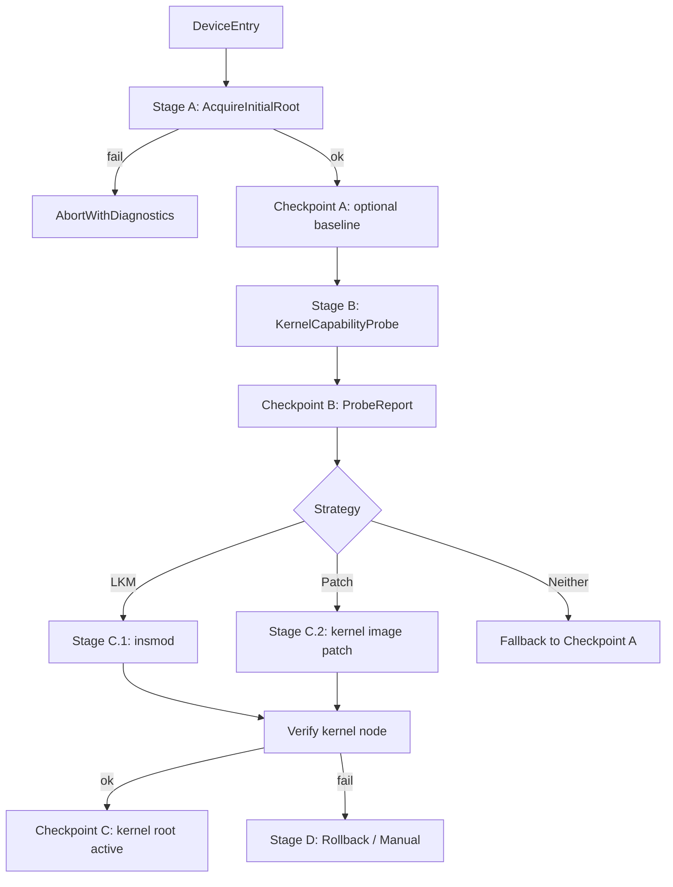

# DECISION-TREE — 提权 4 阶段流水线

> 派生自旧 4 阶段决策树文档（已清理）。
> 与 [VISION.md](VISION.md) 收敛后裁掉了 "Magisk 优先 / 双兼容" 叙事；保留**通用骨架与失败分类**，因为这部分价值与方向无关。

## 1. 核心原则

> **先拿可用 root → 再探测内核能力 → 尝试内核持久化 → 失败回退到已知良态。**

## 2. 流水线

## 3. Stage 简表

| Stage | 目的 | 关键约束 |
|---|---|---|
| **A** 拿 root | 获取一个可用 root shell | Checkpoint A **可选**；锁 BL + 临时 root 场景应避免写镜像 |
| **B** 探测 | 决定后续策略（LKM / patch / 拒绝） | 输出结构化 `ProbeReport` |
| **C** 持久化 | 安装并**验证内核节点** | patch 类需镜像洁净（[PRINCIPLES.md](PRINCIPLES.md) §3） |
| **D** 回退 | 恢复到上一良态 | **不假设可自动回退**，默认输出手动指引 |

### Stage B 探测项

| 探测 | 影响 |
|---|---|
| `CONFIG_MODULES` / 模块签名 / lockdown | LKM 可行性 |
| 内核版本 / KMI / GKI | LKM + patch 可行性 |
| `CONFIG_KPROBES` | hook 可行性 |
| 分区布局（A/B、init_boot vs boot、AVB） | patch 与回退安全 |
| SELinux mode | 策略注入方式 |
| seccomp 状态 | seccomp 处理策略 |

### Checkpoint 规范

- 位置：`/data/adb/sakisu/checkpoints/`（重构时可改）
- 格式：JSON + 完整性 hash
- 保留：每 Stage 最近 3 个
- 回退前必校：hash + slot 一致性 + 可读性

## 4. 失败分类（标准化错误码）

| 前缀 | 类别 | 示例 |
|---|---|---|
| `F_INSTALL_*` | 安装阶段 | `F_INSTALL_BOOT_WRITE`、`F_INSTALL_RAMDISK_PARSE`、`F_INSTALL_PATCH_MISMATCH`、`F_INSTALL_MODULE_SIGN`、`F_INSTALL_AVB_LOCKED` |
| `F_NODE_*` | 内核节点 | `F_NODE_NOT_FOUND`、`F_NODE_IOCTL_FAIL`、`F_NODE_VERSION_MISMATCH`、`F_NODE_PERMISSION` |
| `F_PROBE_*` | 探测阶段 | `F_PROBE_NO_ROOT`、`F_PROBE_CONFIG_READ`、`F_PROBE_PARTITION_MAP` |
| `F_RECOVERY_*` | 回退阶段 | `F_RECOVERY_CHECKPOINT_CORRUPT`、`F_RECOVERY_FLASH_FAIL`、`F_RECOVERY_SLOT_MISMATCH`、**`F_RECOVERY_MANUAL_REQUIRED`** |

上表为最常用的代表项；新仓应在 `error-codes.md` 中维护完整码表。

## 5. 用户可见解释

每个决策必须有一句人话理由。范例：

- "你的内核支持加载模块 — 选用 LKM 策略以获得最佳兼容性。"
- "模块签名强制开启 — 回退到内核 patch 策略。"
- "两种内核策略在本机均不安全 — 保持当前 root 不动。"
- "内核 root 安装失败（节点无响应） — 已回退到上一良态。"
- "无法自动恢复，请按以下步骤手动刷回：……"
